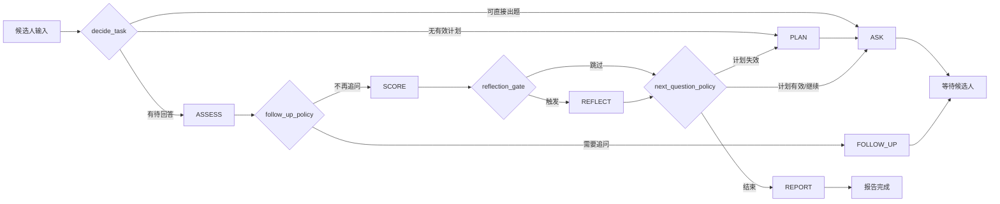
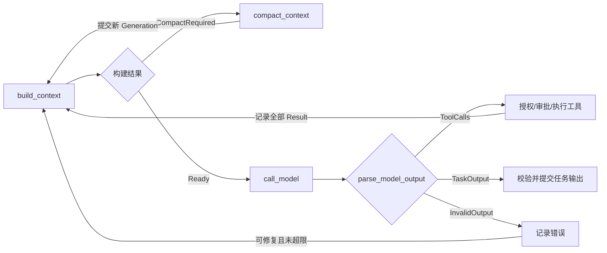

# Agent Runtime：基于 LangGraph 的面试执行内核

## 1. 设计目标

Runtime 负责推进一场面试：接收输入、选择下一步、调用模型与工具、等待候选人回答、评分、生成报告，并在失败或进程重启后继续执行。它管理**执行顺序和状态**；模型本轮看见什么由 [Context Build](./contextbuild.md) 决定，历史压缩由 [Compact](./compact.md) 决定。

参考 OpenAI Agents 的 Runner 语义：一次运行中可以反复经历“模型输出 → 工具调用/切换执行者 → 再调用模型”，直到产生最终输出或需要暂停。底层采用 LangGraph `StateGraph`、条件路由和 Checkpointer；本项目自己实现面试状态、事件记录和模型/工具适配。不要把 OpenAI Agents `Runner.run()` 再包在单个 LangGraph 节点中，否则图无法观察和恢复内部工具循环。

首版采用一个面试 Agent 加确定性业务节点。`Planner`、`Interviewer`、`Evaluator`、`Reporter` 是阶段角色与输出契约，不必一开始就做成四个互相 Handoff 的 Agent。

```text
Client / Candidate Input
        ↓
   Runtime Graph ──→ Event Store
   ├─ Context Builder
   ├─ Model Adapter
   ├─ Tool Runtime
   └─ Checkpointer
        ↓
Question / Score / Report / Pause / Error
```

## 2. 三个不同的执行边界

| 边界                 | 含义                                               | 标识                                         |
| -------------------- | -------------------------------------------------- | -------------------------------------------- |
| `InterviewSession` | 一场持续数十轮的面试，拥有计划、Episode 和最终报告 | `session_id`；映射 LangGraph `thread_id` |
| `Run`              | 一次外部输入触发的图执行，直到输出、暂停或失败     | `run_id`                                   |
| `ModelStep`        | Run 内的一次实际模型调用；工具返回后会产生下一步   | `step_id` / `model_call_id`              |

普通候选人回答是**新的 Run**：带同一 `thread_id` 和新的 `input_event_id` 调用图。工具审批是**同一 Run 的暂停与恢复**：使用同一 `thread_id`，把审批结果传给 `Command(resume=...)`。这两个入口不能混用，否则可能把新回答误当审批恢复值。

一次 Run 的终点可以是 `WAITING_CANDIDATE`、`REPORT_READY` 或 `FAILED`；`QUESTION_SCORED` 可作为 Run 内的中间状态。等待候选人回答时，图完成本次 Run 并保存状态；无需把每个普通问答都做成长时间 `interrupt()`。

## 3. Runtime State

Graph State 保存**恢复执行所需的最小快照和引用**，不保存完整 Prompt、全部历史、长工具结果或 Memory 正文。这些内容从 Event Store、Artifact Store 和 Context Builder 按版本读取。

```python
class InterviewRuntimeState(TypedDict):
    session_id: str
    run_id: str
    task_instance_id: str | None
    task_handler_version: str | None
    phase: Literal["PLANNING", "INTERVIEWING", "EVALUATING", "REPORTING"]
    task: Literal["PLAN", "ASK", "ASSESS", "FOLLOW_UP", "SCORE", "REFLECT", "REPORT"] | None
    status: Literal[
        "RUNNING", "WAITING_CANDIDATE", "WAITING_APPROVAL",
        "QUESTION_SCORED", "REPORT_READY", "FAILED", "CANCELLED"
    ]
    generation: int
    last_input_event_id: str | None
    plan_id: str | None
    active_question_id: str | None
    active_episode_id: str | None
    follow_up_count: int
    repair_count: int
    last_assessment_ref: str | None
    pending_tool_call_ids: tuple[str, ...]
    pending_approval_id: str | None
    context_projection_id: str | None
    context_package_ref: str | None
    compact_request_ref: str | None
    last_model_result_ref: str | None
    last_model_outcome_ref: str | None
    last_reflection_ref: str | None
    model_step_count: int
    tool_call_count: int
    budget_usage_ref: str | None
    failure_ref: str | None
```

状态字段通过节点返回的 update 改变。`QuestionEpisode`、`InterviewPlan` 和 Evidence 的权威版本保存在业务存储/Event Store；State 只保留 ID 与当前阶段。`generation` 用于 Context Build 的一致性快照和并发更新检查。模型客户端、数据库连接、Tool Registry 等依赖通过运行配置注入，不序列化进 Checkpoint。

`build_context` 将完整模型请求保存在受控 Artifact Store，并把引用写入 `context_package_ref`；`call_model` 按引用读取。这样在两节点之间重启时能使用同一请求，避免重新检索造成输入漂移。敏感内容的存储期限与访问控制由 Artifact Store 负责。

首版只允许同一 `session_id` 同时有一个可写 Run。新的候选人输入通过 `input_event_id` 去重，并检查是否属于当前 `active_question_id`。后续若需要并行评分或检索，再为独立分支明确状态合并规则。

### 四个执行契约（不增加图节点）

`InterviewRuntimeState` 是可恢复的 Graph State；下面四个对象分别解决依赖注入、对外返回、资源约束和任务差异。它们不改变 §4 的路由，也不把客户端、连接池或大段正文塞入 Checkpoint。

| 抽象 | 生命周期与最小内容 | 谁使用、谁不能决定 |
| ---- | ---------------- | ------------------ |
| `RuntimeContext` | 一次执行入口创建的依赖容器：`session_id`、`run_id`、`trace_id`，Event/Artifact/Checkpoint 存储接口，模型与工具适配器，Clock，`RunBudget` 和 `TaskHandlerRegistry`。新 Run 新建；审批恢复时用相同 `run_id` 重建，不能依赖进程内对象存活。 | 节点从运行配置取得；它提供能力，不保存业务事实，也不代替 Graph State。 |
| `RunResult` | 一次调用对外的类型化结果：`run_id`、`status`、`output_ref`、`pending_approval_id`、`failure_ref`、`last_event_id`、`usage`。`output_ref` 指向问题或报告等已提交产物；完整正文按权限另取。 | Runtime 在图停止或中断后组装；调用方按 `status` 区分等待候选人、等待审批、报告完成、失败或取消，不从最后一条模型文本猜测。 |
| `RunBudget` | 每个 Run 固定的限额与持久化用量：模型步骤、工具调用、修复、压缩尝试、输入/输出 Token、成本和截止时间。覆盖业务模型、压缩模型和工具；保留各类别明细。 | 节点执行前检查并预留，结果持久化后按 Usage 结算；超限只能由 Runtime 停止或降级，模型不得扩额。 |
| `TaskHandlerRegistry` | `task → handler` 的版本化映射；每个 Handler 定义任务指令/输出 Schema、允许的工具集合、TaskOutput 校验和提交适配。首版注册 `PLAN/ASK/ASSESS/FOLLOW_UP/SCORE/REFLECT/REPORT`。 | `build_context`、工具授权、校验和提交节点按当前 `task` 取同一版本的 Handler；`decide_task`、追问/反省/下一题策略仍由 Runtime 决定。 |

`RunBudget` 的权威用量是按 `run_id + operation_id` 幂等记录的用量账本，`budget_usage_ref` 指向其快照；State 中的 `model_step_count`、`tool_call_count` 是便于路由的缓存。模型/工具调用前先检查剩余额度并登记预留；恢复时先查既有结果及结算，不能因为节点重试再扣一次，也不能因响应超时就假定零消耗。未知 Usage 按预留上限暂记，待对账修正。审批暂停的等待时间不消耗模型步骤，但截止时间是否继续流逝由 Run 配置明确规定。

Handler 在 Run 开始时固定版本并记入 Run Event，恢复时必须使用同版；无法加载旧版时停止并报告兼容性错误，不能悄悄用新版 Schema 解释旧输出。Handler 可以调用领域服务提交数据，但提交前必须经过 Runtime 的幂等键和证据校验。`RunResult` 仅在持久化状态与最后 Event 对账后返回；`WAITING_APPROVAL` 是中断结果，不是新的 Run。

## 4. 两层路由：业务任务与单任务 Agent Loop

`phase` 表示面试阶段，`task` 表示下一次模型调用要产出什么。一个阶段可以包含多次模型调用：例如收到回答后先执行 `ASSESS`，再由 Runtime 决定走 `FOLLOW_UP` 还是 `SCORE`。路由由代码根据持久化状态决定；模型只提交结构化建议和内容。

先看业务路由：反省不是每次模型调用后的通用回环，而是**评分提交后**的一次可选任务。图中的任务都复用下方同一条模型/工具执行子图。



图中的 `PLAN` 等是同一执行子图的 `task` 值，不是七套重复的 LangGraph 节点。`decide_task` 处理新输入；`advance_business` 在任务提交后执行图中的策略门，并设置下一次 `task`。达到结束条件时，`decide_task` 也可直接选择 `REPORT`。

每个任务的执行子图如下。**预算检查发生在每次模型调用之前**；只有 Builder 在完成确定性缩减后仍需要压缩历史，才返回 `CompactRequired`。工具与修复都会回到构建入口，因此下一次 ModelStep 重新检查预算。



`compact_context` 按 [Compact](./compact.md) 的 L1–L4 策略执行；某一层需要 LLM 时，由该节点调用模型并记录消耗，不把压缩模型的输出误当当前业务任务输出。工具审批在工具分支暂停并恢复；拒绝作为 Tool Result 返回当前任务。压缩无效、不可修复输出或循环超限进入 `FAILED`。

| 节点                     | 输入与职责                                                  | 下一跳                                     |
| ------------------------ | ----------------------------------------------------------- | ------------------------------------------ |
| `ingest_input`         | 校验 Session、顺序和幂等键，持久化新输入                    | `decide_task`                            |
| `decide_task`          | 按当前 Plan、Episode、输入类型和结束条件设置`task`        | `build_context` 或 `END`               |
| `build_context`        | 为当前`task` 构建投影；返回 Ready、CompactRequired 或失败 | `call_model`、`compact_context` 或失败 |
| `compact_context`      | 按请求压缩可压缩历史，提交 CompactionEvent 与新 Generation  | `build_context` 或失败                   |
| `call_model`           | 用该请求调用模型并持久化响应/Usage                          | `parse_model_output`                     |
| `parse_model_output`   | 归一化为 ToolCalls、TaskOutput 或 InvalidOutput             | 工具、验证或修复                           |
| `authorize_tools`      | 校验工具名、Schema、权限和调用额度                          | 执行、审批或失败                           |
| `execute_tools`        | 幂等执行全部获准调用并成组记录结果                          | `build_context`                          |
| `validate_task_output` | 依据当前`task` 的 Schema 和业务不变量校验                 | 提交、修复或失败                           |
| `commit_task_output`   | 写业务 Event 并更新 Episode/Plan/Reflection/Report 引用     | `advance_business`                       |
| `advance_business`     | 执行追问、反省及下一题策略，设置下一`task`                | `build_context` 或 `END`               |

`build_context` 在每个业务 ModelStep 前执行；它只提出压缩请求，Runtime 的 `compact_context` 提交后再以新 Generation 重建。Runtime 不复用 Run 开头的一份 Prompt 来应付后续工具循环。

## 5. 何时规划，以及每个 Task 的出口

首次提问前必须有有效 `InterviewPlan`。仅在 Plan 缺失、JD/简历或 Rubric 的关键版本变化、剩余时间显著变化、能力覆盖出现无法用当前计划处理的缺口时进入 `PLAN`；普通每轮回答不重新规划。`PLAN` 失败时停止出题，不让 `ASK` 在没有能力目标的状态下自由生成。

`decide_task` 的入口优先级是：先处理与当前 Episode 匹配的候选人回答（`ASSESS`）；若没有开放 Episode，再检查 Plan 是否有效（`PLAN`）；Plan 有效且面试未完成时选 `ASK`；达到结束条件时选 `REPORT`。收到不属于当前问题的回答应拒绝或挂起，不能触发一次新的 `PLAN` 来掩盖顺序错误。

| `task`      | 模型应该输出                                   | Runtime 校验与提交后                               |
| ------------- | ---------------------------------------------- | -------------------------------------------------- |
| `PLAN`      | 能力目标、优先级、时间预算和候选题策略         | 保存 Plan，进入`ASK`                             |
| `ASK`       | 与当前能力目标匹配的一道主问题                 | 创建`OPEN` Episode，返回等待回答                 |
| `ASSESS`    | 回答覆盖点、缺口、矛盾、建议追问及来源引用     | 保存 Assessment；由`follow_up_policy` 决定下一步 |
| `FOLLOW_UP` | 针对明确缺口的一道追问                         | 附加到同一 Episode，返回等待回答                   |
| `SCORE`     | Rubric 维度分数、解释和原始 Evidence Ref       | 校验并提交评分，关闭 Episode                       |
| `REFLECT`   | 本题的覆盖缺口、策略偏差和下一题建议（带来源） | 保存 ReflectionRecord；再执行下一题策略            |
| `REPORT`    | 汇总各 Episode 的结论和来源                    | 校验报告证据，完成面试                             |

`ASSESS` 不是评分：它只判断这道题是否还需要追问。`follow_up_policy` 按顺序检查硬约束：当前 Episode 是否仍开放、是否达到追问上限、是否超时、剩余时间是否足够、建议追问是否针对未覆盖能力；硬约束不允许时走 `SCORE`。建议有效且有追问额度时走 `FOLLOW_UP`。策略记录 `decision` 与 `reason`，不能只存模型自然语言。

`reflection_gate` 只在 `SCORE` 成功提交后检查：评分置信度低、证据互相矛盾、能力覆盖不足、连续追问无效，或到达配置的定期复盘间隔时进入 `REFLECT`；否则跳过。这个门由确定性规则与阈值决定，不再额外调用模型。`REFLECT` 读取已提交的评分和 Evidence，产出有来源的策略建议；它不能改写原始 Evidence 或已提交分数，建议写入 `ReflectionRecord` 并供下一题策略参考。一次 Episode 最多执行一次 `REFLECT`，失败时记录失败并按既定计划继续或转人工，不反复反省。

`next_question_policy` 在评分后（若触发反省，则在反省后）检查剩余能力、最低覆盖要求与时间预算；若计划失效先进入 `PLAN`，否则有目标就选下一个能力并进入 `ASK`，满足结束条件才进入 `REPORT`。如果评分输出缺 Evidence，不能先关闭 Episode 再补证据。

## 6. 单次模型调用与工具循环

当前 `task` 决定模型指令、输出 Schema 和可用工具。`PLAN` 可用 JD/简历检索，`ASK/FOLLOW_UP` 可用题库与背景检索，`ASSESS/SCORE/REFLECT` 可用精确 Evidence 读取，`REPORT` 可用已关闭 Episode 查询。工具集合由 Runtime 授权，模型不能通过输出任意名字调用未注册工具。

每次模型响应被解析为互斥的 `ToolCalls`、`TaskOutput` 或 `InvalidOutput`：

```text
build_context(task, generation)
  ├─ CompactRequired → compact_context → commit new generation → build_context
  └─ Ready → call_model(context_package_ref)
→ parse_model_output
  ├─ ToolCalls    → authorize → execute → persist results → build_context(同一 task)
  ├─ TaskOutput   → validate → commit → 对应业务策略或 END
  └─ Invalid      → persist error → build_context(同一 task，次数有限)
```

同一响应若既有工具调用又有文本，工具调用优先；文本不能被当作最终 TaskOutput 提交。并行工具调用须全部拿到结果或明确失败结果，再返回模型，保持 call/result 配对。需要审批时暂停当前工具调用，恢复后仍回到工具执行；拒绝审批则写拒绝结果并回到 `build_context`，让模型继续当前 `task`。

上述所有循环统一经过 `RunBudget`，而非各节点各自维护互不相认的上限。模型步骤按真实业务模型调用计数；压缩模型调用单独记类别，但共享总 Token/成本限额；工具调用、修复与压缩尝试也各有上限。LangGraph recursion limit 只是额外保险，不能代替业务预算。达到限制后记录明确失败，不把半成品问题或评分提交。

一次典型问答跨三个 Run：初次运行完成 `PLAN → ASK` 并等待；候选人回答后运行 `ASSESS → FOLLOW_UP` 并等待；候选人追问回答后运行 `ASSESS → SCORE →（满足条件才 REFLECT）→ ASK`，下一题再次等待。只有模型真的要求工具时，才在当前 `task` 内走工具回边；只有构建结果要求压缩时，才走压缩回边。

## 7. Checkpoint、Event 与恢复

| 存储                    | 权威内容                                 | 用途                   |
| ----------------------- | ---------------------------------------- | ---------------------- |
| LangGraph Checkpoint    | 节点边界的可恢复 Graph State             | 恢复执行位置、等待审批 |
| Append-only Event Store | 已发生的输入、模型、工具、问题、评分事实 | 审计、回放、证据引用   |
| Artifact Store          | 大模型输出、长工具结果、媒体与文件       | 按 ID 读取完整内容     |
| ContextProjection       | 某次模型请求的选择结果和 Hash            | 重放当时模型看见的内容 |

Checkpoint 不能替代 Event Store：它是运行快照，可能被更新；Event 则是可追溯的事实。节点执行可能在 Checkpoint 写入前后重试，所以 Event 写入与外部工具调用都必须有幂等键，例如 `session_id + run_id + step_id + call_id`。

可观测性先沿现有执行边界建层级，不加新节点：`Session(session_id) → Run(run_id) → Task(task + task_instance_id) → ModelStep(step_id) / ToolCall(call_id)`。一次 Run 中重复进入同一 `task` 时必须生成新的 `task_instance_id`；工具调用挂在发起它的 ModelStep 下，Compact 记录为该 Task 下的独立操作。每层记录开始/结束、状态、耗时、重试次数、预算变化、输入/输出引用与错误类别；Span 属性只放安全 ID、Hash 和脱敏统计，不放候选人回答或完整 Prompt。V0 至少保证 Event/日志可按这些 ID 串起执行链；统一 Trace/Span 导出与仪表盘在下一步补齐。

对工具副作用采用“先记录调用意图，再执行，再记录结果”的状态转换。恢复时先查是否已有相同 `call_id` 的完成结果；有则复用，没有则按工具的幂等能力重试或转人工确认。模型响应也以请求 Hash 与 `model_call_id` 记录：进程在收到响应后崩溃时，先尝试复用已保存响应，再考虑重新调用，避免产生不同的下一步。

Event Store 与 Checkpointer 若不在同一事务中，需用幂等写入和恢复对账处理两者之间的崩溃窗口；不能假设一次节点执行天然 exactly-once。关键节点在返回 State update 前先确认 Event 已持久化，恢复时以 Event ID 对账。

## 8. 暂停、审批与取消

普通候选人回答通过新的输入 Event 开始下一 Run。有权限要求的工具调用才进入 `request_approval`，用 LangGraph `interrupt()` 保存暂停点和待审批的 `call_id`；审批回复使用同一个 `thread_id` 的 `Command(resume=...)`。

LangGraph 恢复 `interrupt()` 时会从所在节点**开头重新执行**，因此 `request_approval` 节点在中断前不做不可重复的外部操作。审批决定带 `approval_id` 去重；拒绝时记录 Tool Result/拒绝原因并回到模型，由模型选择其他路径或结束。

取消时标记 Run 为 `CANCELLED`，停止启动新 ModelStep/Tool Call。已经执行的外部副作用不能靠回滚 State 消除，需按工具类型执行补偿或明确记录“已执行但 Run 已取消”。

## 9. 失败分类与处理

| 类型                 | Runtime 动作                                               |
| -------------------- | ---------------------------------------------------------- |
| 模型超时/限流        | 有上限的重试；尽量复用同一 ContextProjection 与请求 Hash。 |
| 模型输出不符 Schema  | 记录解析错误，有限次修复；不提交不完整评分。               |
| 工具暂时失败         | 以同一幂等键重试；最终失败作为 Tool Result 反馈给模型。    |
| 工具权限不足         | 暂停审批或返回拒绝；不得继续执行。                         |
| Context Overflow     | 让 Builder 增大安全余量并重建；次数有上限。                |
| Generation 冲突      | 放弃旧投影，从新快照重建当前 ModelStep。                   |
| Evidence/Rubric 缺失 | 阻止评分提交，转恢复或人工处理。                           |
| Session 并发输入     | 拒绝过期回答或排队；不得覆盖当前 Episode。                 |

所有重试都记录 `attempt` 和原因。只有瞬时错误适合自动重试；候选人输入缺失、权限拒绝或证据不足属于业务结果，不应被无限重试掩盖。

## 10. 最小实现骨架

以下是与内层循环对应的图骨架。`decide_task` 只处理新输入，`advance_business` 只处理已提交的业务输出；两者都写入下一次 `task`，不直接调用模型：

```python
from langgraph.graph import END, START, StateGraph

builder = StateGraph(InterviewRuntimeState)
builder.add_node("ingest_input", ingest_input)
builder.add_node("decide_task", decide_task)
builder.add_node("build_context", build_context)
builder.add_node("compact_context", compact_context)
builder.add_node("call_model", call_model)
builder.add_node("parse_model_output", parse_model_output)
builder.add_node("authorize_tools", authorize_tools)
builder.add_node("execute_tools", execute_tools)
builder.add_node("request_approval", request_approval)
builder.add_node("record_tool_denial", record_tool_denial)
builder.add_node("record_validation_error", record_validation_error)
builder.add_node("validate_task_output", validate_task_output)
builder.add_node("commit_task_output", commit_task_output)
builder.add_node("advance_business", advance_business)
builder.add_node("fail_run", fail_run)

builder.add_edge(START, "ingest_input")
builder.add_edge("ingest_input", "decide_task")
builder.add_conditional_edges("decide_task", route_entry, {
    "model": "build_context", "done": END,
})
builder.add_conditional_edges("build_context", route_context, {
    "ready": "call_model", "compact": "compact_context",
    "fail": "fail_run",
})
builder.add_conditional_edges("compact_context", route_compact, {
    "rebuilt": "build_context", "fail": "fail_run",
})
builder.add_edge("call_model", "parse_model_output")
builder.add_conditional_edges("parse_model_output", route_model_result, {
    "tools": "authorize_tools", "output": "validate_task_output",
    "repair": "record_validation_error", "fail": "fail_run",
})
builder.add_conditional_edges("authorize_tools", route_authorization, {
    "execute": "execute_tools", "approval": "request_approval",
    "denied": "record_tool_denial", "fail": "fail_run",
})
builder.add_conditional_edges("request_approval", route_approval, {
    "approved": "execute_tools", "denied": "record_tool_denial",
})
builder.add_edge("record_tool_denial", "build_context")
builder.add_edge("execute_tools", "build_context")
builder.add_conditional_edges("validate_task_output", route_validation, {
    "valid": "commit_task_output", "repair": "record_validation_error",
    "fail": "fail_run",
})
builder.add_edge("record_validation_error", "build_context")
builder.add_edge("commit_task_output", "advance_business")
builder.add_conditional_edges("advance_business", route_business, {
    "model": "build_context", "done": END,
})
builder.add_edge("fail_run", END)

graph = builder.compile(checkpointer=durable_checkpointer)
config = {"configurable": {"thread_id": session_id}}
```

上面的两张图分别表示业务路由和单任务执行子图；代码骨架是精确节点拓扑。实现后可用 `print(graph.get_graph().draw_mermaid())` 导出实际图；排查边和循环时看自动生成图。

执行入口先以 `run_id` 装配 `RuntimeContext` 并固定 Handler Registry 与 Budget 配置，再将其作为非持久化运行依赖供节点读取；审批恢复时重建同一上下文。图停止后，入口从已提交的 State/Event 组装 `RunResult`。这些步骤都在图外，不额外添加 LangGraph edge。

`advance_business` 对 `PLAN` 设置下一任务 `ASK`，对 `ASSESS` 执行 `follow_up_policy`，对 `SCORE` 先执行 `reflection_gate`，必要时设置 `REFLECT`，否则执行 `next_question_policy`；对 `REFLECT` 执行 `next_question_policy`；对 `ASK/FOLLOW_UP/REPORT` 返回 `done`。`call_model` 和 `compact_context` 通过同一 `RunBudget` 检查、预留和结算，分别记录业务与压缩类别；State 计数只在对应操作首次成功登记后更新。

V0 先实现单 Session 串行执行、提问/回答/评分闭环和有上限的工具循环；随后接入持久化 Checkpointer、审批恢复、取消与并发控制。每个节点先定义 Event、幂等键和失败出口，再填模型 Prompt 或复杂规划逻辑。

## 11. 验收场景

1. 首次出题先执行一次 `PLAN`；普通回答不重复规划。一次候选人回答触发追问，第二次回答触发评分并关闭同一 Episode；每个 ModelStep 有独立 ContextProjection。
2. 模型连续调用两次工具，工具 Call/Result 完整成组，第二次模型调用能看到第一次工具结果。
3. 审批暂停后进程重启，使用相同 `thread_id` 恢复，不重复执行工具。
4. `call_model` 或 `execute_tools` 在结果持久化后、Checkpoint 前崩溃，恢复时复用已有结果。
5. 重复提交同一 `input_event_id` 不生成第二个候选人回答或第二份评分。
6. Context Builder 报证据缺失或受保护内容超预算时，Runtime 停止评分/模型调用并留下可诊断错误。
7. 构建结果为 `CompactRequired` 时只压缩可准入的旧历史，提交新 Generation 后重新构建；压缩失败不调用业务模型，也不丢原始 Evidence。
8. 低置信度评分触发一次 `REFLECT`，正常评分跳过；反省结果不改已提交分数，但可改变下一题目标。
9. 模型响应已结算而 Checkpoint 未写入时恢复：重放不重复扣预算，`RunResult` 仍能指向唯一的已提交输出。
10. 同一 Run 内 `ASSESS → SCORE → ASK` 形成三个 Task 实例，各 ModelStep/ToolCall 可按父 ID 串联；日志和 Trace 不含候选人原文。

## 参考依据

- [OpenAI Agents SDK：Running agents](https://developers.openai.com/api/docs/guides/agents/running-agents)：Agent Loop、工具/Handoff 后继续、Run 与下一轮输入的区别。
- [LangGraph：Graph API](https://docs.langchain.com/oss/python/langgraph/graph-api)：State、Node、Edge、Checkpoint 边界与节点重执行。
- [LangGraph：Use the graph API](https://docs.langchain.com/oss/python/langgraph/use-graph-api)：条件边、循环和图的 Mermaid/PNG 导出。
- [LangGraph：Persistence](https://docs.langchain.com/oss/python/langgraph/persistence)：Checkpointer 与 Store 的职责。
- [LangGraph：Interrupts](https://docs.langchain.com/oss/python/langgraph/interrupts)：暂停、`Command(resume=...)` 和恢复时节点重执行。
